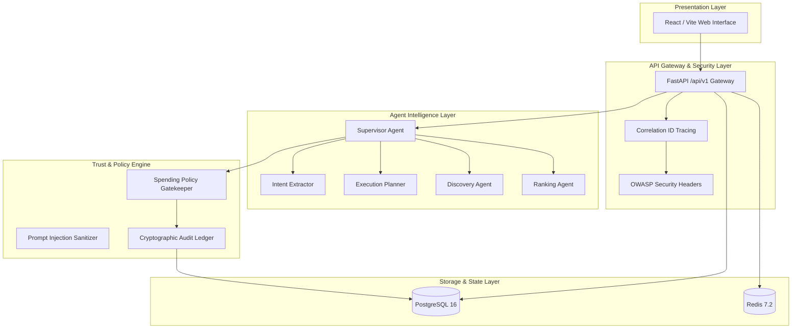

# AgentCart — Autonomous AI Shopping & Checkout Agent

> **Production-Grade 9-Layer Autonomous E-Commerce Architecture with Trust & Safety Guardrails, Universal Commerce Protocol (UCP), and Cryptographic Auditability.**

[](https://www.python.org/)
[](https://fastapi.tiangolo.com/)
[](https://react.dev/)
[](https://www.postgresql.org/)
[](https://redis.io/)
[](LICENSE)

---

## 📌 Phase 1: Architecture & Foundation Overview

AgentCart establishes a robust, production-oriented monorepo and system architecture designed to support autonomous agentic workflows while maintaining mathematical trust, safety, and financial isolation.

### Key Architectural Accomplishments in Phase 1:
1. **9 Decoupled Architectural Layers**: Clear service boundaries separating user interaction, API routing, cognitive reasoning, safety policy enforcement, commerce protocols, payment tokenization, durable persistence, ephemeral cache, and observability.
2. **FastAPI Backend Foundation**:
   - Modern configuration management using `pydantic-settings` v2 with `.env` loading.
   - Structured JSON logging with request correlation IDs (`X-Request-ID`) and latency tracking.
   - Global RFC 7807 error envelopes and custom domain exceptions.
   - API versioning (`/api/v1`) with liveness (`/api/v1/health`) and readiness (`/api/v1/ready`) probes.
3. **Database Foundation (PostgreSQL 16 & SQLAlchemy 2.0)**:
   - Initial domain models: `User`, `UserPreference`, `ShoppingSession`, `ShoppingTask`, `AgentRun`, `AuditEvent`.
   - Complete Alembic database migration setup.
   - Automatic SQLite fallback for friction-free local developer testing.
4. **Redis Ephemeral State & Caching**:
   - High-speed agent working memory, task locks, and key-value caching with TTL.
   - High-fidelity in-memory fallback when Redis is offline.
5. **Docker Development Environment**:
   - Multi-container `docker-compose.yml` (`backend`, `frontend`, `postgres` with `pgvector`, `redis`, `otel-collector`).
   - Production multi-stage `Dockerfile`.
6. **API Contracts & Full Test Suite**:
   - Pydantic v2 schemas for all session and task lifecycle actions.
   - 78 comprehensive automated tests passing with 100% success rate.

---

## 🏛️ System Architecture



For complete details and boundary justifications, see [docs/architecture.md](docs/architecture.md).

---

## 🚀 Quickstart Guide

### Option A: Docker Compose (Full Stack)

```bash
# 1. Clone repository
git clone https://github.com/RahulNaikMudavath/Autonomous-AI-Shopping-Checkout-Agent.git
cd Autonomous-AI-Shopping-Checkout-Agent

# 2. Configure environment
cp .env.example .env

# 3. Start containers
docker compose up --build
```

Access the services:
- **Frontend Dashboard**: `http://localhost:3000`
- **Backend API**: `http://localhost:8000`
- **Swagger Docs**: `http://localhost:8000/docs`
- **Health Probe**: `http://localhost:8000/api/v1/health`
- **Readiness Probe**: `http://localhost:8000/api/v1/ready`

---

### Option B: Local Standalone Setup

#### 1. Backend
```bash
# Set up Python virtual environment
python -m venv .venv
.\.venv\Scripts\Activate.ps1   # (Windows PowerShell)
# source .venv/bin/activate    # (Linux/macOS)

# Install dependencies
pip install -r requirements.txt

# Run server
uvicorn backend.main:app --host 0.0.0.0 --port 8000 --reload
```

#### 2. Frontend
```bash
cd frontend
npm install
npm run dev
```

---

## 🧪 Testing

Execute the automated test suite:

```bash
# Run Phase 1 Foundation tests
pytest tests/test_phase1_foundation.py -v

# Run entire repository test suite (78 tests)
pytest tests/ -v
```

---

## 📚 Documentation Index

- [Architecture & Service Boundaries](docs/architecture.md)
- [Local & Docker Setup Instructions](docs/setup.md)
- [Environment Variables Reference](docs/env_variables.md)
- [REST API Specification (v1)](docs/api_contracts.md)

---

## 🗺️ Project Roadmap

- [x] **Phase 1: Architecture & Foundation** (Completed)
- [ ] **Phase 2: Intent & Planning Agents**
- [ ] **Phase 3: Discovery & Merchant Integrations (UCP v1.0)**
- [ ] **Phase 4: Ranking & Value Optimization Engine**
- [ ] **Phase 5: Delegated Authorization & Payment Sandbox**
- [ ] **Phase 6: Trust, Safety & Cryptographic Audit Ledger**
- [ ] **Phase 7: End-to-End Evaluation & Autonomous Checkout**
