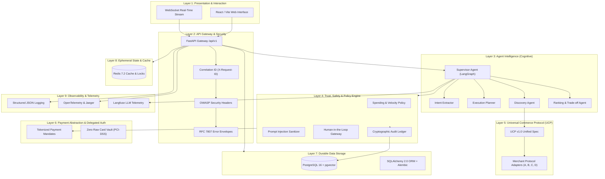
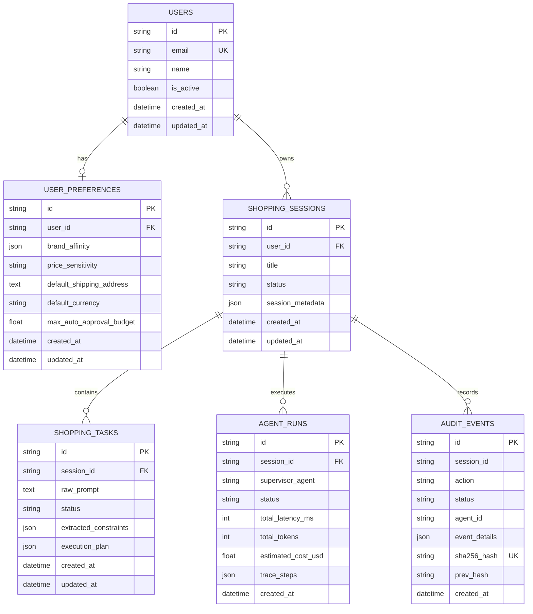

# AgentCart: System Architecture & Foundation Document (Phase 1)

## 1. Executive Architecture Summary

**AgentCart** is an autonomous AI-driven commerce intelligence platform designed to handle complex user procurement requests with strict trust & safety guardrails, merchant protocol standardization, deterministic spending policies, and tamper-evident auditability.

Unlike naive LLM chatbots that directly invoke external APIs, AgentCart employs a **9-Layer Decoupled Architecture**. This architecture strictly separates non-deterministic AI cognitive reasoning from deterministic commerce workflows, cryptographic safety policies, financial authorizations, and durable data persistence.

---

## 2. The 9 Architectural Layers & Boundary Justifications

### Layer 1: Presentation & User Experience Layer
- **Responsibilities**:
  - Renders user interfaces, reactive dashboards, comparison tables, and execution traces.
  - Manages real-time bidirectional WebSocket connections for streaming agent thought processes.
  - Presents step-up Human-In-The-Loop (HITL) confirmation dialogs for high-value purchases.
- **Why this boundary exists**:
  - **Decoupling**: Decouples client presentation logic from backend workflow execution. The frontend is completely stateless and can be swapped or augmented with mobile apps, CLI tools, or browser extensions without altering backend logic.

### Layer 2: API Gateway & Security Layer
- **Responsibilities**:
  - Centralized ingress routing with strict API versioning (`/api/v1`).
  - Request tracing via automatic `X-Request-ID` injection and latency calculation (`X-Response-Time-MS`).
  - OWASP security headers (`nosniff`, `DENY` framing, `Strict-Transport-Security`, `Permissions-Policy`).
  - Unified RFC 7807 compliant JSON error envelopes (`code`, `message`, `details`, `request_id`, `timestamp`).
  - Liveness (`/api/v1/health`) and Readiness (`/api/v1/ready`) probes.
- **Why this boundary exists**:
  - **Perimeter Defense & Traceability**: Protects internal domain services from unauthenticated, malformed, or malicious traffic. Guarantees that every incoming request has an immutable trace ID propagated across all asynchronous subagent invocations and log records.

### Layer 3: Agent Intelligence & Context Orchestration Layer
- **Responsibilities**:
  - Multi-agent cognitive reasoning (Hierarchical Supervisor, Intent Extractor, Multi-Step Planner, Discovery Agent, Ranking Agent).
  - Context window management and memory retrieval.
- **Why this boundary exists**:
  - **Cognitive Isolation**: Isolates non-deterministic LLM operations from deterministic business rules. If an LLM hallucinates or produces unexpected reasoning, it cannot directly execute financial charges or bypass policy gates.

### Layer 4: Trust, Safety & Policy Engine Layer
- **Responsibilities**:
  - Hard constraint enforcement: maximum budget ceilings, daily velocity limits, allowed category whitelists, and blocked merchant blacklists.
  - Prompt injection defense: analyzes user queries and third-party merchant descriptions for indirect prompt injection attacks.
  - Cryptographic Audit Ledger: SHA-256 hash-chained immutable logging for every policy evaluation and sensitive action.
- **Why this boundary exists**:
  - **Zero-Trust Autonomous Execution**: Autonomous agents must operate within mathematically verifiable guardrails. The policy engine is independent of the agent prompt and cannot be overridden by prompt engineering.

### Layer 5: Universal Commerce Protocol (UCP) & Merchant Abstraction Layer
- **Responsibilities**:
  - Standardizes e-commerce interactions into normalized operations (`discover`, `get_quote`, `reserve_inventory`, `create_cart`, `execute_checkout`).
  - Merchant Protocol Adapters that translate proprietary merchant APIs (REST, GraphQL, MCP) into normalized UCP schemas.
- **Why this boundary exists**:
  - **Vendor Neutrality & Modularity**: Prevents tight coupling to specific merchant platforms. Adding a new merchant only requires authoring an adapter without changing agent logic.

### Layer 6: Payment Abstraction & Delegated Authorization Layer
- **Responsibilities**:
  - Scoped payment tokens, virtual delegated mandates, and escrow holds.
  - Zero raw payment card storage (PCI-DSS compliance).
- **Why this boundary exists**:
  - **Financial Blast Radius Containment**: Agents never touch raw PANs or CVVs. Payments are tokenized and pre-authorized with strict cryptographic spending limits and single-use expiry.

### Layer 7: Durable Data & Domain Storage Layer
- **Responsibilities**:
  - Relational persistence in PostgreSQL 16 using SQLAlchemy 2.0 ORM and Alembic migrations.
  - Foundational domain tables: `users`, `user_preferences`, `shopping_sessions`, `shopping_tasks`, `agent_runs`, `audit_events`.
- **Why this boundary exists**:
  - **ACID Transactional Integrity**: Guarantees persistence of user accounts, session histories, tasks, and audit logs with foreign key consistency and cascade controls.

### Layer 8: Ephemeral State & Distributed Cache Layer
- **Responsibilities**:
  - Fast in-memory working state storage in Redis 7.2 for multi-agent reasoning scratchpads.
  - Distributed locks and session TTL management.
  - In-memory mock fallback for offline local testing.
- **Why this boundary exists**:
  - **Latency Optimization & Stateless Scalability**: Prevents high-frequency agent working memory updates from thrashing PostgreSQL disks, allowing horizontal scaling of backend API instances.

### Layer 9: Observability, Telemetry & Evaluation Layer
- **Responsibilities**:
  - Structured JSON access logging with correlation IDs.
  - OpenTelemetry distributed tracing hooks.
  - LLM token, cost, and latency telemetry (Langfuse integration).
  - Automated benchmark evaluation frameworks.
- **Why this boundary exists**:
  - **Continuous Reliability & Auditability**: Provides complete visibility into agent decisions, execution latency, and cost per query without interfering with user-facing request latency.

---

## 3. Database Domain Models (Phase 1 Baseline)

---

## 4. Security & Compliance Model

1. **Least Privilege**: Subagents only have access to their designated tools (e.g. Discovery Agent can search catalogs but cannot initiate checkouts).
2. **Deterministic Gatekeeping**: All agent checkout recommendations must pass through the deterministic Policy Engine before a payment mandate is minted.
3. **Cryptographic Chaining**: Every audit log entry is linked to its predecessor using `SHA-256(prev_hash + timestamp + action + status + agent_id + details)`. Any modification breaks the chain and triggers immediate security alerts.
4. **Resilience & Graceful Degradation**: If PostgreSQL or Redis is temporarily unavailable during offline developer tests, automatic in-memory fallbacks ensure development and tests continue uninterrupted.
